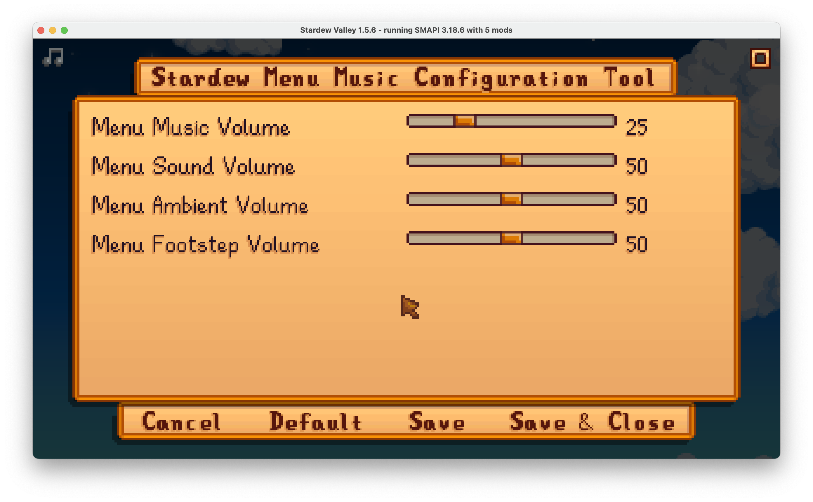
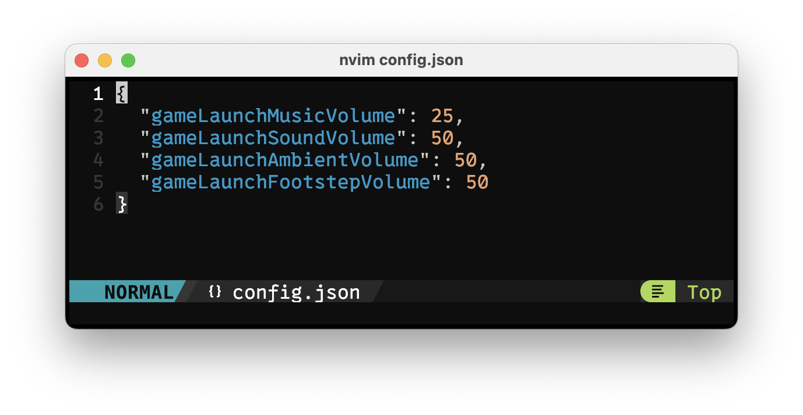

# Stardew Menu Music Configuration Tool
A simple mod for Stardew Valley that allows you to control the various different volumes of the menu (which is, by default, set to 100% all the time), without modifying your individual save settings. 

## Requirements
- [SMAPI](https://smapi.io) (mandatory)
- [Generic Mod Config Menu](https://github.com/spacechase0/StardewValleyMods/tree/develop/GenericModConfigMenu) (optional)

The Generic Mod Config Menu allows you to control the volumes from in-game, but is not required (as you can always edit the volumes from the config file).

## Installation
Download the latest version from the [Releases](), and [install to your SMAPI mods folder](https://stardewvalleywiki.com/Modding:Player_Guide/Getting_Started#Install_mods).

## Usage
After launching the game with the mod installed, you can either modify the config file directly or, if you have the Generic Mod Config Menu installed, you can modify from the settings cog on the Stardew Menu:

If using the in-game menu, the volume changes in real-time (i.e. you don't need to restart for changes to take effect).

To modify the config directly, you can navigate to the Mods folder and modify the `config.json` file. Accepted values range from 0-100:

The values in the menu and config file represent the following:

| Menu Item | Effect |
|--------------|-----------|
| Music | Changes the background music volume. |
| Sound | Changes the sound volume (e.g. button clicks, etc.). |
| Ambient | Changes the ambient volume (e.g. birds chirping, wind howling, etc.). |
| Footstep | Changes the footstep volume (plays when hovering over menu items). |